# CS 5513 DrivingSchoolManagement (Spring 2016)
Use JSP + HTML + CSS as frontend and Oracle as backend to manage appointments of student drivers with driving instructors.

## Screenshots

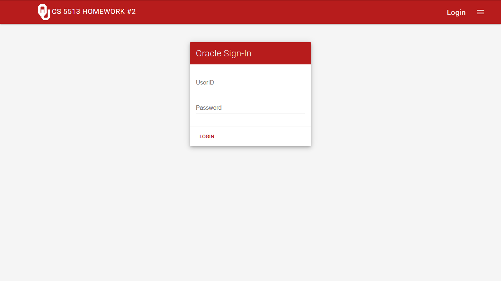

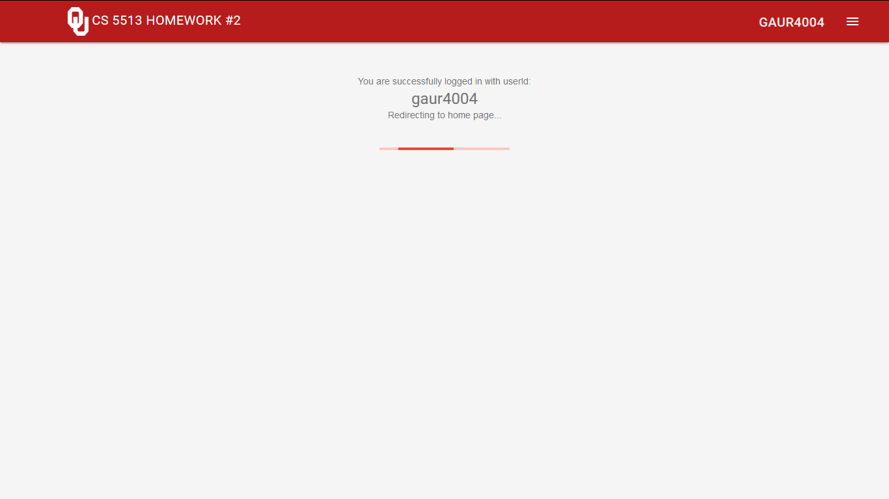

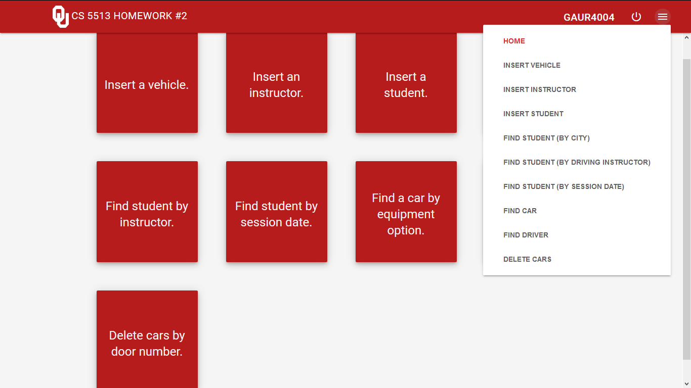

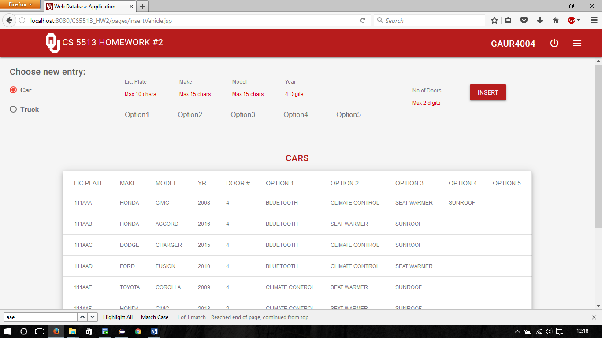

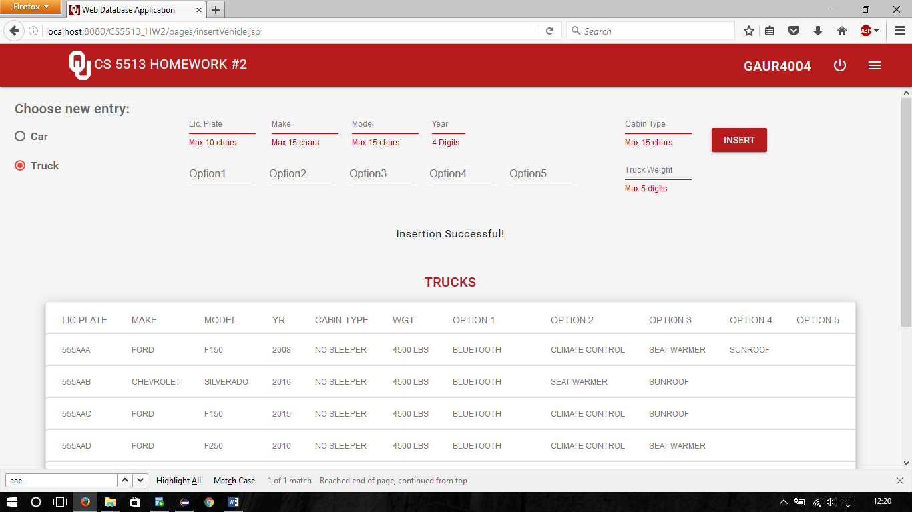

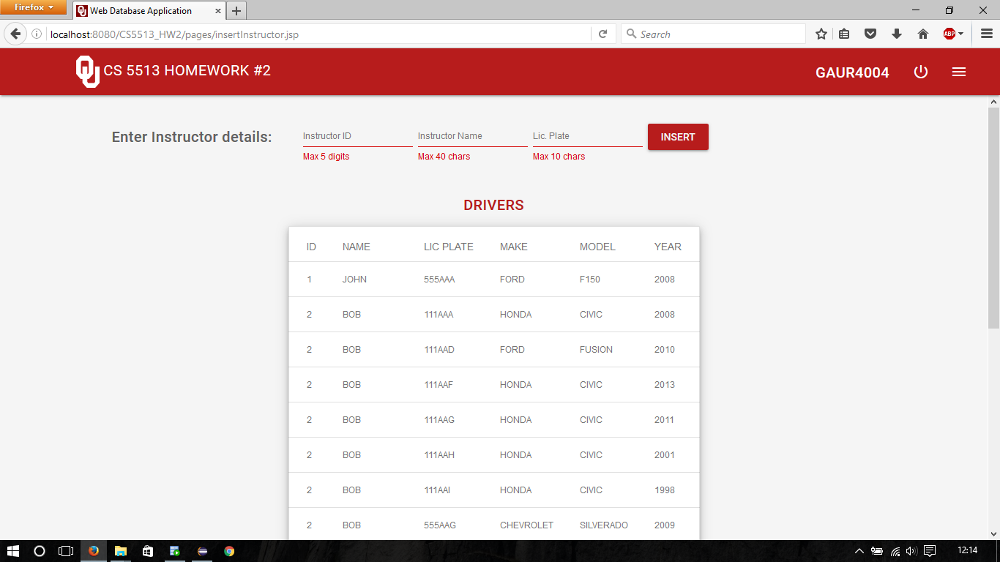

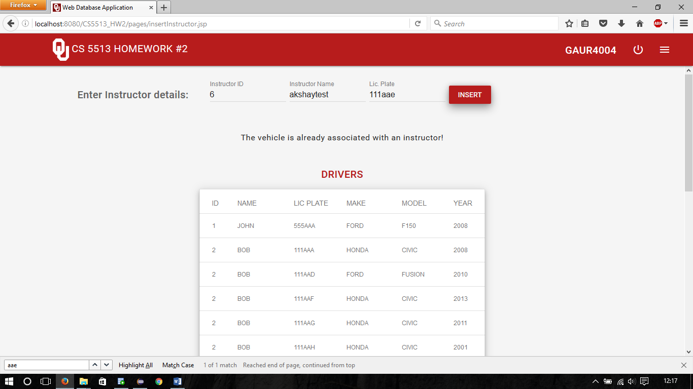

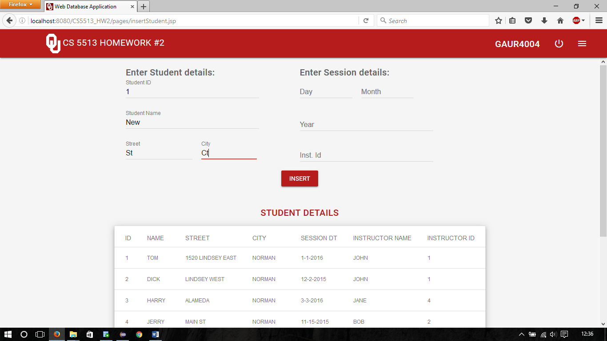

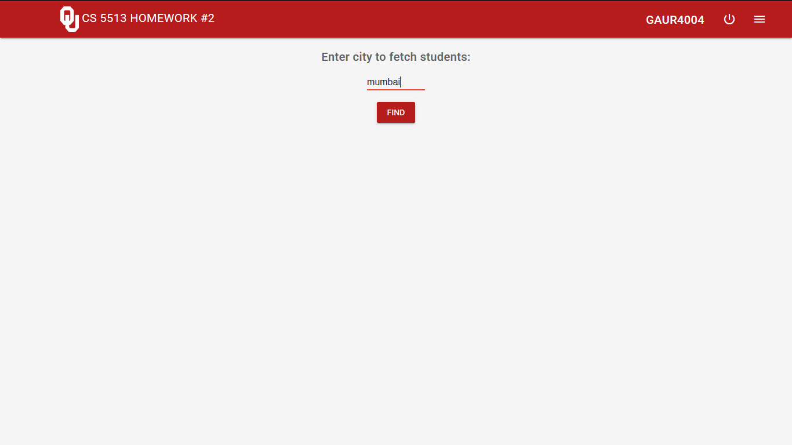

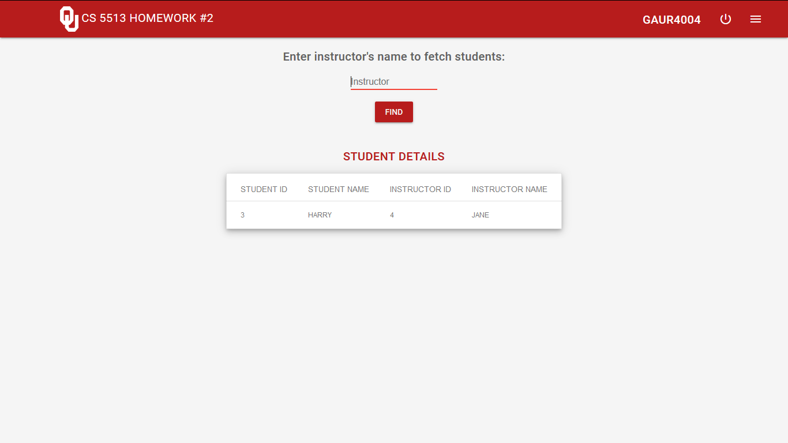

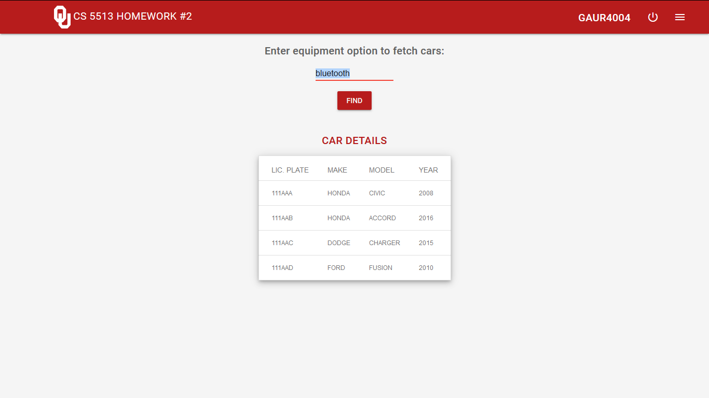

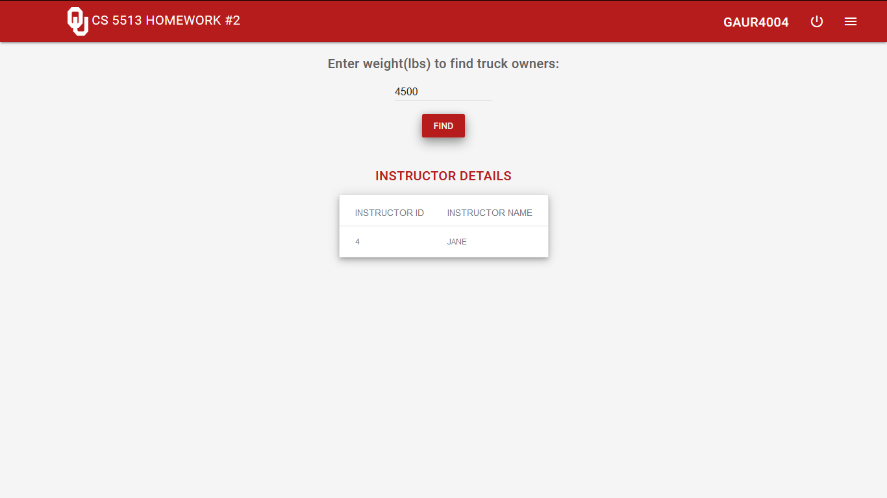
